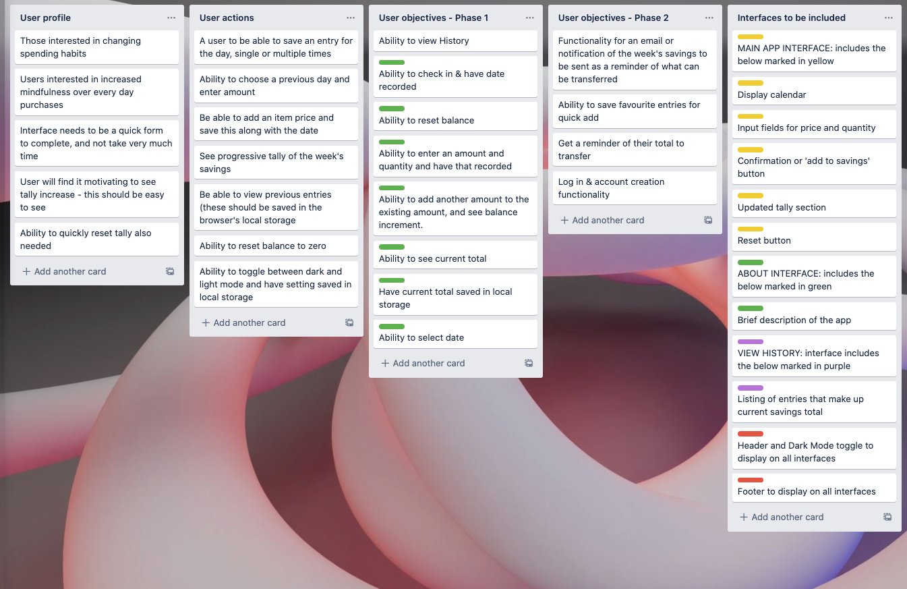
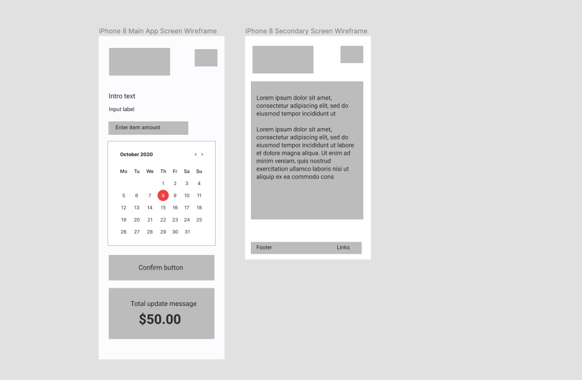
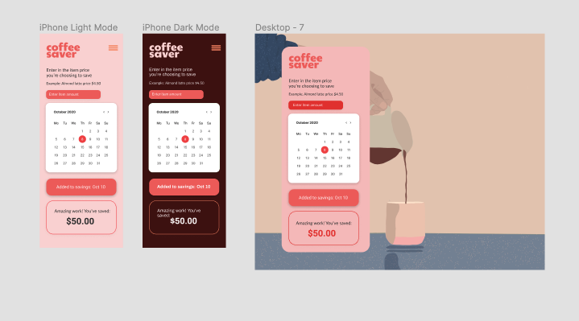
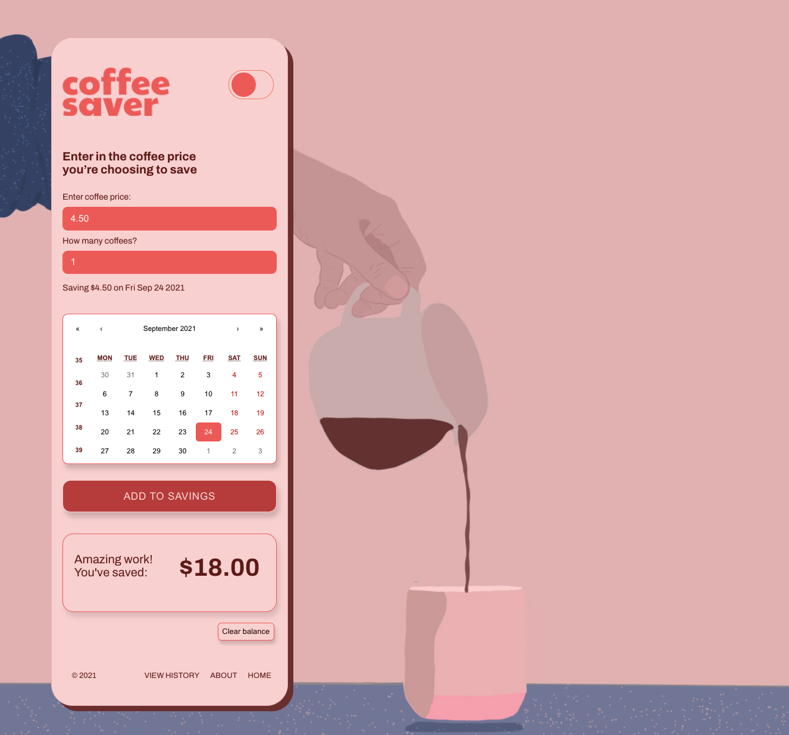
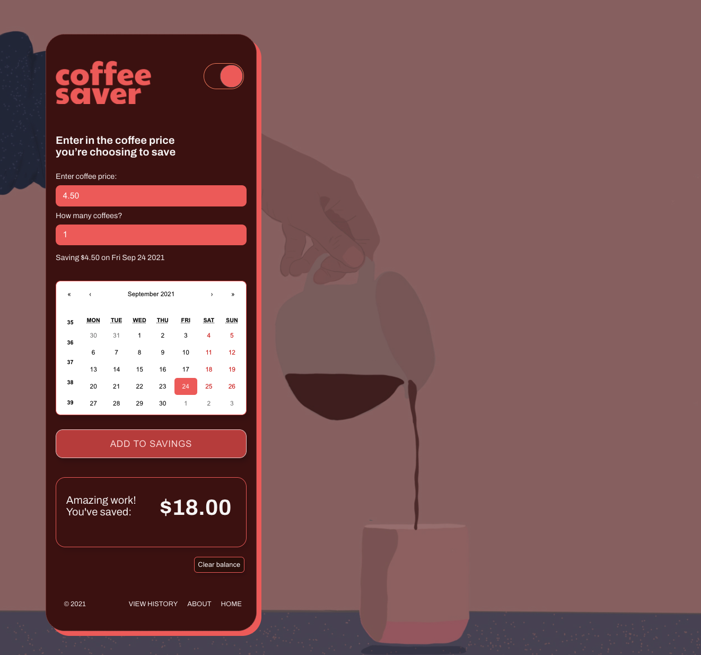

# The Coffee Saver App

Visit the live app here: http://coffeesaverapp.surge.sh/

The idea behind this app is to record the coffees (or other regularly purchased item) that you decide not to buy. It's a habit tracker that encourages you to save regular purchases and see the balance of what you're not spending increase. It aims to provide motivation around changing habits and noticing how small expenses can quickly add up.

The app incorporates a calendar which also allows users to select dates to allocate their saving entry to. This data is saved in the browser's local storage, and can easily be reset by selecting the 'Clear history' button.

## Tech used:
This frontend application has been built with React, and utilises local storage for the saving of entries, and dark/light mode theme management 

## Installation instructions
### Dependencies
The Coffee Saver app includes the below dependencies:
+ React Router - please see this link for quick start instructions https://reactrouter.com/web/guides/quick-start
+ React-calendar - please see this link for installation instructions https://www.npmjs.com/package/react-calendar This app also incorporates the specific React-calendar css file
+ This app was created with Create React App

## General approach
Initially I developed a Trello board to list out the user's objectives and actions, and the phases of the project, i.e. what might be included in this release, and what might be developed for phase 2. From here wireframes were created, and then more high-fidelty designs in Figma. 

Next was to start creating the components in React, and stepping through each of my user's needs according to priority.

## Planning
Initial thoughts were about the user's needs, how the app could be updated through a simple UI, how data could be stored without a back-end, and which device it would predominately be used on.

### User stories and phases
A Trello board was the first step to map out the user actions, needs and tasks of the project.

### Wireframes
Wireframes were created in Figma to demonstrate and prove the UI of the app, and determine what inputs or sections of content were needed.

### Design
High-fidelity designs were developed using Figma, incorporating the UI components, visual design, and dark and light mode themes
The app was also designed primarily for mobile use, however can be used on desktop or iPad devices.

### Next steps
Additional functionality to be added:
+ ability to export data to a txt file
+ ability to save favourite entries for an even easier add

## Screenshots of desktop interface, both light and dark mode

Acknowledgement: This project was bootstrapped with [Create React App](https://github.com/facebook/create-react-app).

